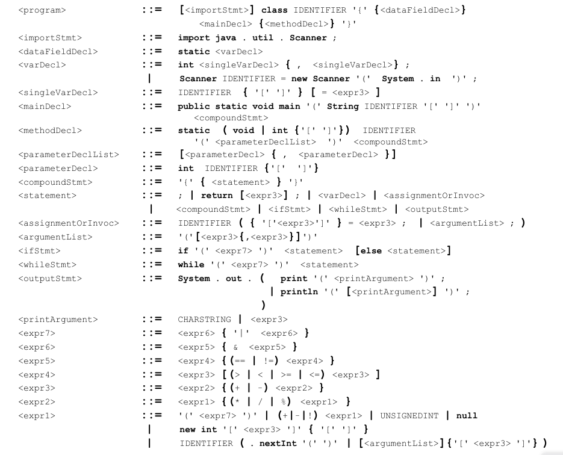

# TinyJ

This is the TinyJ compiler assignment from CSCI 316 (Principles of Programming Languages) 
at CUNY Queens College, as taught by Professor Tat Yung Kong.

The original TinyJ compiler was written by Professor Kong sometime in the 90's. Apparently,
before he did this, the class was taught in Pascal and thus he translated it to Java back
then.

I do not know if his code has a license of any sort, but all credit and rights goes to him.

As part of this assignment we were to complete the Parser and Translator and the TinyJ 
virtual machine instructions.

Thus, the code that I wrote for this can be found in TJ/ParserAndTranslator.java and 
TJ/virtualMachine/*instr.java

The following are the EBNF (Extended Backus-Naur Form) rules that were to be implemented
in the parser:

